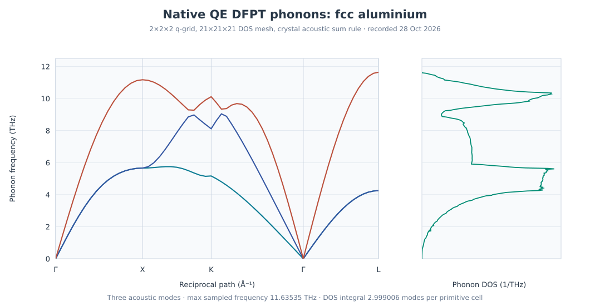

Aluminium: phonons (QE)
=======================

.. literalinclude:: ../../../nanoworks/examples/Al-phonon/Al-phonon.py
   :language: python
   :lines: 5-
   :caption: Al-phonon.py

:download:`Download Al-phonon.py <../../../nanoworks/examples/Al-phonon/Al-phonon.py>`.

Run
---

Requires QE and the managed pseudopotentials.

GPAW uses Phonopy displacements; QE uses native DFPT for this shared input.

.. code-block:: bash

   cd ~/.nanoworks/examples/Al-phonon
   dftsolve -E QE -p 4 -i Al-phonon.py -g Al_mp-134_primitive.cif

Results
-------

The result directory uses the CIF stem. Read frequency against path
distance in the band table and frequency against mode count in the phonon DOS.
A one-atom primitive cell has three acoustic branches. Negative
frequencies indicate imaginary modes. Small acoustic residuals near Gamma
need numerical convergence checks before diagnosing an instability.
The thermal tables give harmonic free energy, entropy and heat capacity.

   Recorded example output.

These example settings need convergence tests before quantitative use.

:doc:`Detailed recorded results <../validation/al-qe-dfpt-phonons>`.
